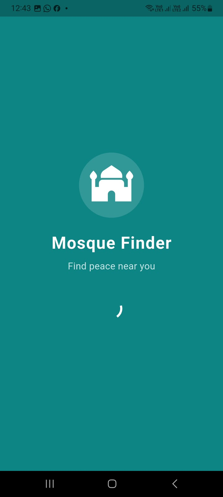
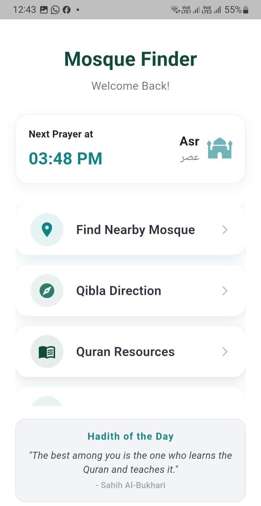
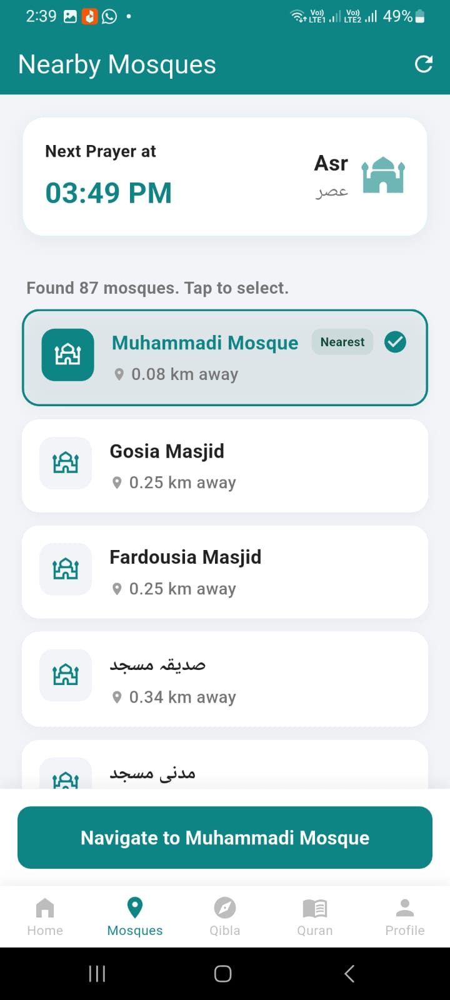
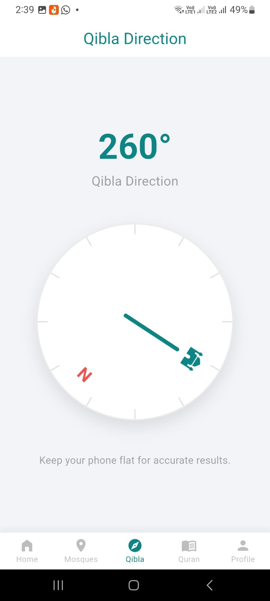
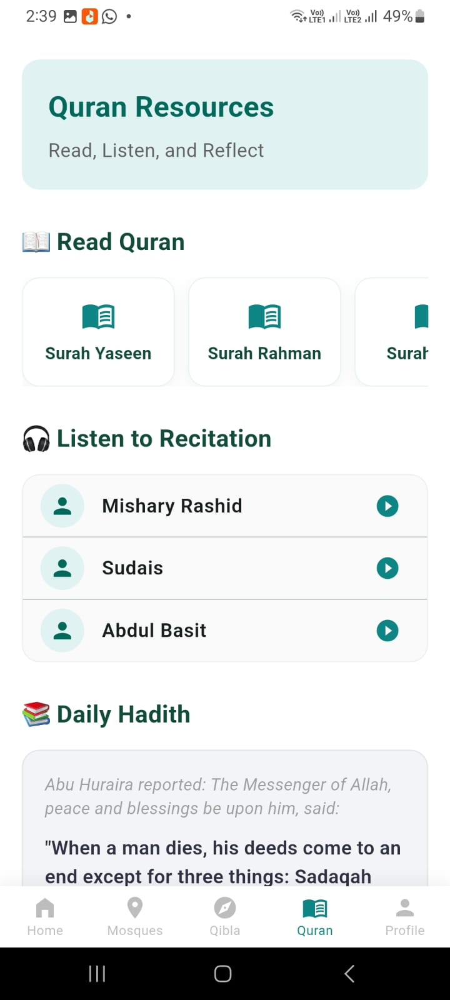
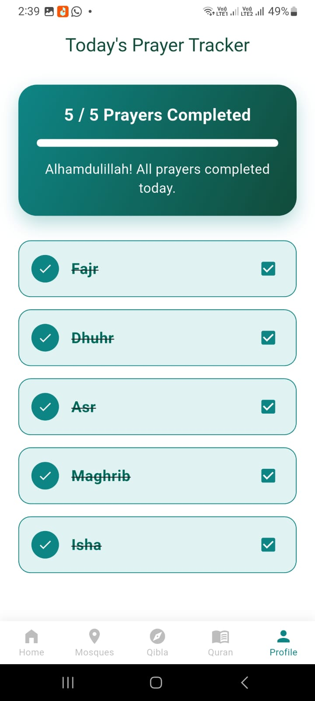

# 🕌 Mosque Finder

A fast, lightweight Flutter app to find nearby mosques — built for Android. Features prayer times, Qibla direction, Quran resources, and a daily prayer tracker.

---

## Screenshots

| Splash | Home | Nearby Mosques |
|--------|------|----------------|
|  |  |  |

| Qibla Direction | Quran Resources | Prayer Tracker |
|-----------------|-----------------|----------------|
|  |  |  |

---

## Features

- 🕌 **Nearby Mosques** — Finds 80+ mosques sorted by distance using Overpass API
- 🧭 **Qibla Direction** — Live compass pointing toward Mecca
- 🕐 **Prayer Times** — Next prayer countdown with Fajr/Dhuhr/Asr/Maghrib/Isha
- 🗺️ **Google Maps** — Interactive map with mosque markers
- 🚗 **One-Tap Navigation** — Opens Google Maps for directions
- 📖 **Quran Resources** — Surah list and recitation links
- ✅ **Prayer Tracker** — Daily 5-prayer completion tracker
- 📿 **Hadith of the Day** — Rotating daily hadith on home screen

---

## Tech Stack

| Layer | Tech |
|-------|------|
| Framework | Flutter (Dart) |
| Maps | google_maps_flutter |
| Mosque Data | Overpass API (OpenStreetMap) |
| Location | geolocator |
| Compass | flutter_compass |
| Navigation | url_launcher |
| Permissions | permission_handler |
| Storage | shared_preferences |

---

## Setup

### 1. Prerequisites

- Flutter SDK installed
- Android device or emulator (API 21+)
- Google Maps API Key

### 2. Clone the repo

```bash
git clone https://github.com/Mr-Zulki/mosque-finder-app.git
cd mosque-finder-app
```

### 3. Add your API Key

Create or open `android/local.properties` and add:

```
MAPS_API_KEY=YOUR_GOOGLE_MAPS_API_KEY_HERE
```

> ⚠️ `local.properties` is in `.gitignore` — never committed. Keep your key safe.

To get a key:
1. Go to [Google Cloud Console](https://console.cloud.google.com)
2. Enable **Maps SDK for Android**
3. Generate an API Key

### 4. Run

```bash
flutter pub get
flutter run
```

---

## Project Structure

```
mosque-finder-app/
├── lib/
│   └── main.dart
├── assets/
│   └── mosque_icon.png
├── screenshots/
│   ├── splash.jpg
│   ├── home.jpg
│   ├── mosques.jpg
│   ├── qibla.jpg
│   ├── quran.jpg
│   └── prayer_tracker.jpg
├── android/
│   ├── app/
│   │   └── build.gradle.kts
│   └── local.properties    # ← your API key (not committed)
├── .gitignore
└── pubspec.yaml
```

---

## Roadmap

- [ ] Quran audio recitation (Mishary Rashid, Sudais, Abdul Basit)
- [ ] Push notifications for prayer times
- [ ] Expand mosque database beyond Faisalabad
- [ ] Dark mode
- [ ] iOS support

---

## Notes

- Optimized for low-end devices (minSdk 21)
- No ads, no login, no tracking
- Mosque data sourced from OpenStreetMap via Overpass API

---

## Author

**Muhammad Zulqurnain Hyder**  
[GitHub](https://github.com/Mr-Zulki) · [LinkedIn](https://linkedin.com/in/muhammad-zulqurnain-hyder-793565280) · [Upwork](https://www.upwork.com/freelancers/~01f6fa9f7519f5da8e)
